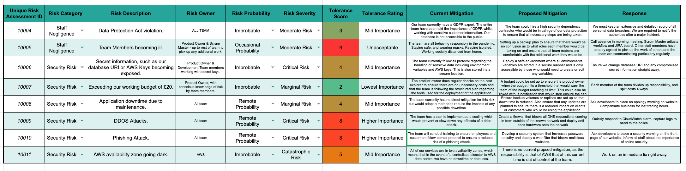
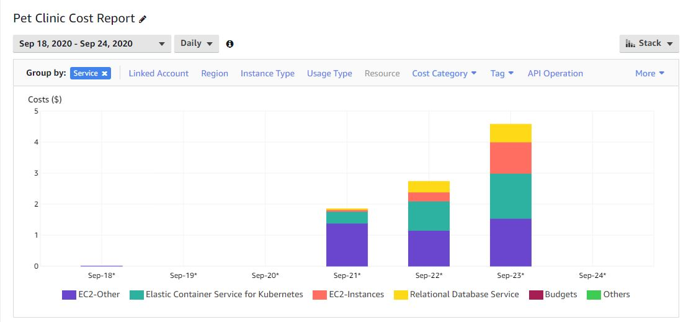

# QA_Final_Project

<!-- TABLE OF CONTENTS -->
## Table of Contents

* [About the Project](#about-the-project)
* [Project Planning](#project-planning)
* [Risk Analysis](#risk-analysis)
* [CI Pipeline](#ci-pipeline)
* [Docker](#docker)
* [Kubernetes](#kubernetes)
* [Terraform](#terraform)
* [Cost Breakdown](#cost-breakdown)
* [Team Members](#team-members)

<!-- ABOUT THE PROJECT -->
## About The Project

The main aim of this project was to plan, design and implement a solution for the deployment an application- specifically a robust front end & back end, integrated with a database.
To achieve this, we could utilise any number of tools and frameworks available to us.
  
Whilst completing this project, we also kept track of the running costs of deployment, producing a breakdown of the monthly estimates for running the services.
As a team, we were incredibly mindful of saving money for the business owner.

## Project Planning

The first week of the project was spent planning and researching the technologies that we will be needing to use to complete the deployment of the app.
We we were very quick to meet as a team and assign individual roles. This translated into an extremely well organised JIRA board, with constant monitoring and use.
 
We chose to run a single week's long sprint, requiring a 2 hour spring planning meeting. In this meeting, we introduced ourselves, set definitions of ready and done, and created a sprint goal. We also played planning poker, to break down work into respective stories and story points.

_"By the end of our first sprint, we hope to achieve a robust and secure end project, worked on equally by the team. If any member feels under pressure to achieve their tasks, we will all step in, as a team."_
 
We ran daily stand-ups every morning, in order to keep track of the project timeline, and ensure empowerment and collaboration. We would often review our JIRA board and sprint burn-down chart, showing effort and productivity, always keeping in mind our end sprint goal.

Jira and agile methodology was integral for achieving was integral to achieving success and completion of this project.

Link to Jira Board: https://team-1579095236068.atlassian.net/jira/software/projects/FP/boards/6

We also utilised other agile tools to plan our project such as planning poker for example.  This tool was used by all of us to rank how important we thought certain tasks were going to be.  This then helped us plan and prioritise which tasks were most important and how much time we should allocate to them.  

## Risk Analysis

Below is a risk assessment that was carried out to help us identify the potential risks and problems that could arise whilst developing or after developing our project. By doing this we could then figure out ways of preventing these problems so that we are prepared if they ever do arise.

<kbd></kbd>

## CI Pipeline

Below is the CI Pipeline that describes our project.  The tools used for each section are also detailed below.

* Kanban Board: Jira
* Version Control: Git/Github
* CI Server: Jenkins
* Infrastructure Management: Terraform
* Cloud server: Amazon Web Services (AWS)
* Containerisation: Docker
* Orchestration Tool: Kubernetes
* Reverse Proxy: NGINX

<kbd></kbd>

## Docker

We used Docker for our containerisation tool, we chose this tool as we all have lots of experience using it and at the minute Docker is the industry standard in containerisation. Docker images are also compatible with other tools we are using such as Kubernetes, this then allows for a smooth deployment.

## Kubernetes

We chose to use Kubernetes for our orchestration tool for a number of reasons.  Firstly it comes with more benefits than the alternative tools available and even though it is more complex than other orchestration tools such as Docker Swarm, it comes with a lot more advantages.  We also used docker to create our images and Kubernetes is compatible with Docker. Since we were using AWS for deployment, kubernetes was a good choice as it allows for the deployments of clusters in AWS using the Elastic Kubernetes Service (EKS). Kubernetes can also easily integrate other services such as load balancing. We took advantage of these by configuring a loadbalancer to balance the traffic coming into the website.

## Terraform

We used terraform to build our infrastructure on AWS. We chose to use Terraform because it would automate the process of building the infrastructure needed to run the app.  We use it to build the VPC, Subnets, EC2 instances, Security groups and many more resources that were needed.  By using Terraform it helped speed up the process and improved development time massively.

## Cost Breakdown

<kbd></kbd>

## Team Members

* Josh Higginson
* Jason Worger
* Bradley Daniels
* Samuel Asquith
