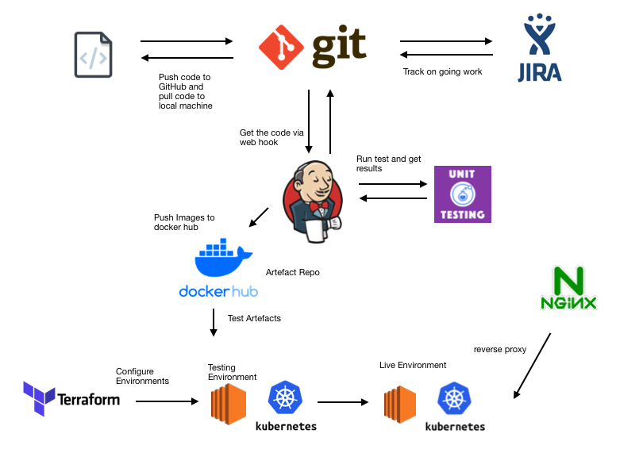

# QA_Final_Project

<!-- TABLE OF CONTENTS -->
## Table of Contents

* [About the Project](#about-the-project)
* [Project Planning](#project-planning)
* [Risk Analysis](#risk-analysis)
* [CI Pipeline](#ci-pipeline)
* [Kubernetes](#kubernetes)
* [Terraform](#terraform)
* [Team Members](#team-members)

<!-- ABOUT THE PROJECT -->
## About The Project

The main aim of this project was to plan, design and implement a solution for the deployment an application, more specifically a front end and back end that will be integrated with a database. To achieve this we could utilise any tools and frameworks needed.  Whilst completing this project we also kept track of the running costs of the deployment and produced a breakdown of the monthly estimates for running the services and any changes that could be adopted to improve the costs.

## Project Planning

The first week of the project was spent planning and researching the technologies that we will be needing to use to complete the deployment of the app. In the final week, we ran daily stand-ups and ensured that we kept track of our tasks by utilising a project tracking board that clearly showed the effort and productivity of the team, each day. For this we used Jira and planned the project out with full expansion on user stories, use cases and tasks needed to complete the project. It also helped  us keep track of any issues or risks that we could face whilst completing the project.

Link to Jira Board: HERE

We also utilised other agile tools to plan our project such as planning poker for example.  This tool was used by all of us to rank how important we thought certain tasks were going to be.  This then helped us plan and prioritise which tasks were most important and how much time we should allocate to them.  

## Risk Analysis

Below is a risk assessment that was carried out to help us identify the potential risks and problems that could arise whilst developing or after developing our project. By doing this we could then figure out ways of preventing these problems so that we are prepared if they ever do arise.

(IMAGE HERE)

## CI Pipeline

Below is the CI Pipeline that describes our project.  The tools used for each section are also detailed below.

* Kanban Board: Jira
* Version Control: Git/Github
* CI Server: Jenkins
* Infrastructure Management: Terraforms
* Cloud server: Amazon Web Services (AWS)
* Containerisation: Docker
* Orchestration Tool: Kubernetes
* Reverse Proxy: NGINX

<kbd></kbd>

## Kubernetes

We chose to use Kubernetes for our orchestration tool for a number of reasons.  Firstly it comes with more benefits than the alternative tools available and even though it is more complex than other orchestration tools such as Docker Swarm, it comes with a lot more advantages.  We also used docker to create our images and Kubernetes is compatible with Docker. Since we were using AWS for deployment, kubernetes was a good choice as it allows for the deployments of clusters in AWS using the Elastic Kubernetes Service (EKS). Kubernetes can also easily integrate other services such as load balancing. We took advantage of these by configuring a loadbalancer to balance the traffic coming into the website.

## Terraform

We used terraform to build our infrastructure on AWS. We chose to use Terraform because it would automate the process of building the infrastructure needed to run the app.  We use it to build the VPC, Subnets, EC2 instances, Security groups and many more resources that were needed.  By using Terraform it helped speed up the process and improved development time massively.

## Team Members

* Josh Higginson
* Jason Worger
* Bradley Daniels
* Samuel Asquith
